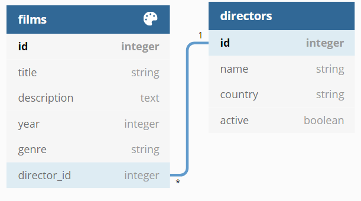

# Rails Movies App Models Challenge

## Setup

1. Make a fork of this repo
2. Clone your fork to your local development environment
3. Install dependencies bundle install
4. Check node dependencies `yarn install --check-files`
5. run `rails s` and check that everything is working (you should see welcome to rails!)

## Challenge

For this challenge, you will be making a movie database. It will be made up of `films` and `directors`. Below is an example Entity Relationship Diagram (ERD).

This shows you the expected attribute names and datatypes you will need to add. Additionally, you will see that films and directors have a one to many relationship; this will also need to be included in your solution. Remember that you will need to use `references` in the generator to add a reference to another model.

After implementing the basic structure, you will need to validate that the data saved to the database is appropriate. To achieve this, you will use ActiveRecord validations to validate the following logic. You should use the default error messages that ActiveRecord provides.

### Films

| Attribute   | Validation                    |
| :---------- | :---------------------------- |
| title       | must be present               |
| description | between 10 and 250 characters |
| year        | greater than, or 1900         |
| genre       | must be present               |

### Directors

| Attribute   | Validation                    |
| :---------- | :---------------------------- |
| name        | between 2 and 50 characters   |
| country     | must be present               |

Once you have this logic implemented, you can implement a couple of scopes to make querying easier later on. You should create the following scopes.

| Name       | Model    | Description                                 |
| :--------- | :------- | :------------------------------------------ |
| crime      | film     | Films where the genre is `crime`            |
| drama      | film     | Films where the genre is `drama`            |
| active     | director | Directors that have an active value of true |

## Tips

 - Use the Rails Console (`rails c`) to test out your models.
 - Remember to run `rails db:migrate` after creating the models and migrations.
 - Feel free to add as many migrations as you need to get things right. Remember, if you make a mistake, you can undo the changes with `rails db:rollback`.
 - To run a single model test, pass the file name to rspec e.g. `rspec spec/models/film_spec.rb`

## Extra - No Automated Tests

**Make sure you have submitted before attempting this step.**

If you have finished this exercise and are looking for more of a challenge, take what you have learned in the previous lessons, controllers, and views, and apply it to this project. You can create a films controller that will allow you to view, create, update, and delete movies through the browser. 

Further, you could think of other models you might want to add to round out the application. You could add an `Actor` model that could have a many to many relationship with a film; you will need to create a join table to allow this. You could also add a rating system for movies. Try to design this for yourself, drawing out the table(s) you think you will need, and then implementing it in code. You can also add any extra validations or scopes you think these models may need.

## Tests and Submitting

At any time you can run bin/rspec to see your progress, it will run the automated tests against your code and let you know what your progress is so far. Once you have all the tests passing, you can submit your challenge. To do this make sure you have committed your work:

1. From the project root `git add .` and add all the files changed in this folder
2. Commit these files to your repository `git commit -m "challenge completed"`
3. Make sure your working tree is clear git status
4. Push these files to your github repository git push origin master
5. Log on to Github and visit your fork of this challenge.
6. Make a pull request to the main branch.
7. Wait and watch the final tests run, if you are successful it will automatically let your educators know you are finished.
